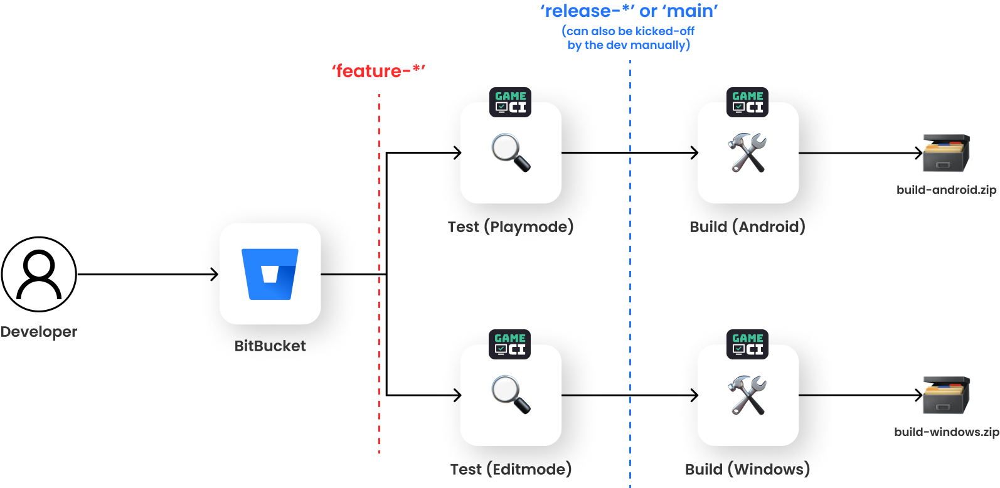

# DevOpsDays London 2023 - Proof of Concept

## Summary
This is a proof of concept CI Pipeline developed as part of the "Pints, DevOps & Consulting for VR" ignite talk for the DevOpsDays London 2023 conference. This POC is largely based on the [unity3d-gitlab-ci-example](https://gitlab.com/game-ci/unity3d-gitlab-ci-example/) project by [GameCI](https://game.ci/). **This repository also includes the same pipeline built in GitLab & GitHub (this was done as part of the research stage).**

## Workflow
The goal of the whole pipeline is to test and build Unity applications. After a workflow is run, it will expose the build artefacts so that they can be downloaded. Below is a visual representation of the pipeline:

## Limitations
There are a few limitations to running this workflow in BitBucket instead of a service like GitHub or GitLab:

* **Relatively low memory** - Initially, there have been cases of Android builds failing due to ***out-of-memory*** errors. This is due to the fact that building for Android is a very resource-heavy process (both CPU, RAM, and Disk Space). It has been remedied by increasing the memory on the runner using the `size` parameter (`size: 2x`). This may cause issues as a project grows.

* **Limited cache space** - Caching is a critical part of speeding up CI Pipelines for Unity. If not done, the whole Unity application would have to be loaded into the container. Furthermore, after a successful build is cached, the subsequent build will only have to rebuild the part of the application that has changed. BitBucket offers a cache of 1GB, which is not enough for Android builds, making it impossible to cache the `build_android` step.

* **Relatively limited use of environment variables/parameters** - Compared to GitLab, BitBucket offers a lot less flexibility in how to customise the Pipeline using defined parameters. A great example of this is how GitLab allows the usage of parameters/variables in defining a custom docker image.
    * In GitLab, the expression `image: $UNITY_CI_IMAGE:$UNITY_VERSION-base-$IMAGE_VERSION`, where `$UNITY_CI_IMAGE`, `$UNITY_VERSION`, and `$IMAGE_VERSION` are variables defined under the `variables` block, is correct, as the values of these variables will be used to generate the name for the image, e.g., `unityci/editor:2022.3.5f1-base-1`.
    * In BitBucket, the expression `image: $UNITY_CI_IMAGE:$UNITY_VERSION-base-$IMAGE_VERSION` would not work as it would be evaluated as `$UNITY_CI_IMAGE:$UNITY_VERSION-base-$IMAGE_VERSION`. It was, therefore, required to hardcode the image as `image: unityci/editor:2022.3.5f1-base-1`.

* **Sharing variables between steps** - There is no integrated or elegant way of sharing environment variables between steps in a workflow. This was remedied by creating the following:
    * A custom `set_up_environment_vars` step that would create the environment variables, put them into a Bash script, and expose that as an artifact (`environment_setup.sh`) for other steps to reuse.
    * A custom `import_env_variables` step that would run the `environment_setup.sh` script and set the environment variables.

## Recommendations
I highly recommend setting up self-hosted runners for any larger project, as it offers more customisation options for the environment and hardware in which the workflow will run, allowing you to circumvent many of the limitations mentioned above.